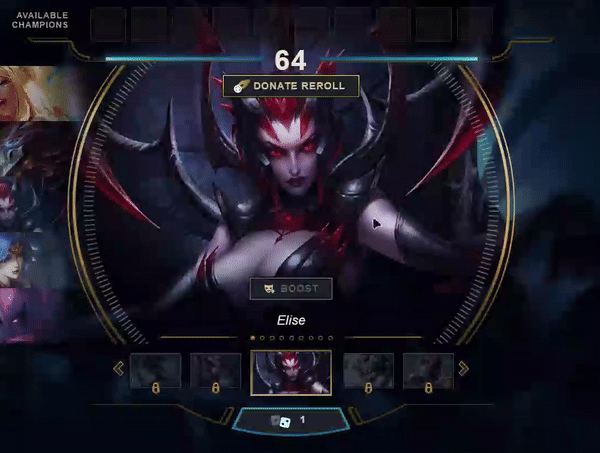

<h3>Reroll Donate Button</h3>
    Donate your rerolls without losing your beloved champ!

## About

A [Pengu Loader](https://github.com/PenguLoader/PenguLoader) plugin that adds a
donate reroll button to any mode that supports rerolls.

## Usage

- Download the latest zip of the repo

- Extract it to your pengu loader plugins folder (so you end-up with something
  that looks like this `C:\Program Files\Pengu Loader\plugins\donate-rerolls`)

## Credits

- [Boda](https://www.behance.net/abdallahalaa9s) for the donation icon
- [Nomi-san](https://github.com/nomi-san) for their amazing work on pengu loader
  and plugins used for reference
